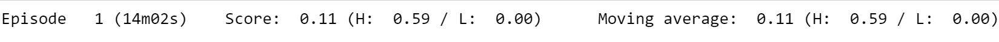

# Project 2: Continuous Control

## Environment to be solved

In a first attempt it was intended to solve the environment with 20 agents, nevertheless the time spent on training the model made really difficult the trial and error attempts. Almost 15 mins for episode, does not give option to tune hyperparamenters and see results quickly.



For that reason, finally, I decided to solve the **Version 1** of the environment, with just ONE agent.

**Goal of Version 1:**
The task is episodic, and in order to solve the environment, your agent must get an average score of +30 over 100 consecutive episodes.

##### &nbsp;

## Approach
Here are the high-level steps taken in building an agent that solves this environment.

1. Evaluate the state and action space.
2. Establish performance baseline using a random action policy.
3. Select an appropriate algorithm and begin implementing it.
4. Run experiments, make revisions, and retrain the agent until the performance threshold is reached.

##### &nbsp;

### 1. Evaluate State & Action Space
The state space space has 33 dimensions corresponding to the position, rotation, velocity, and angular velocities of the robotic arm. There are two sections of the arm &mdash; analogous to those connecting the shoulder and elbow (i.e., the humerus), and the elbow to the wrist (i.e., the forearm) on a human body.

Each action is a vector with four numbers, corresponding to the torque applied to the two joints (shoulder and elbow). Every element in the action vector must be a number between -1 and 1, making the action space continuous.

##### &nbsp;

### 2. Establish Baseline
Before building an agent that learns, I started by testing an agent that selects actions (uniformly) at random at each time step.

```python
env_info = env.reset(train_mode=False)[brain_name]     # reset the environment
states = env_info.vector_observations                  # get the current state (for each agent)
scores = np.zeros(num_agents)                          # initialize the score (for each agent)
while True:
    actions = np.random.randn(num_agents, action_size) # select an action (for each agent)
    actions = np.clip(actions, -1, 1)                  # all actions between -1 and 1
    env_info = env.step(actions)[brain_name]           # send all actions to tne environment
    next_states = env_info.vector_observations         # get next state (for each agent)
    rewards = env_info.rewards                         # get reward (for each agent)
    dones = env_info.local_done                        # see if episode finished
    scores += env_info.rewards                         # update the score (for each agent)
    states = next_states                               # roll over states to next time step
    if np.any(dones):                                  # exit loop if episode finished
        break
print('Total score (averaged over agents) this episode: {}'.format(np.mean(scores)))
```

Running this agent a few times resulted in scores from 0.03 to 0.09. Obviously, if the agent needs to achieve an average score of 30 over 100 consecutive episodes, then choosing actions at random won't work.

##### &nbsp;

### 3. Implement Learning Algorithm

#### Deep Deterministic Policy Gradient (DDPG)
The chosen algorithm for this project is outlined in [this paper](https://arxiv.org/pdf/1509.02971.pdf), _Continuous Control with Deep Reinforcement Learning_, by researchers at Google Deepmind. In this paper, the authors present "a model-free, off-policy actor-critic algorithm using deep function approximators that can learn policies in high-dimensional, continuous action spaces." They highlight that DDPG can be viewed as an extension of Deep Q-learning to continuous tasks.

To start with, I used [this single-agent DDPG](https://github.com/udacity/deep-reinforcement-learning/tree/master/ddpg-pendulum) as a template, and also [this other](https://github.com/udacity/deep-reinforcement-learning/tree/master/ddpg-bipedal). As handbook it also has been used the Udacity's classroom concepts and lessons.

#### Actor-Critic Method
Actor-critic methods leverage the strengths of both policy-based and value-based methods.

Using a policy-based approach, the agent (actor) learns how to act by directly estimating the optimal policy and maximizing reward through gradient ascent. Meanwhile, employing a value-based approach, the agent (critic) learns how to estimate the value (i.e., the future cumulative reward) of different state-action pairs. Actor-critic methods combine these two approaches in order to accelerate the learning process. Actor-critic agents are also more stable than value-based agents, while requiring fewer training samples than policy-based agents.

You can find the actor-critic logic implemented as part of the `Agent()` class [here](https://github.com/ASO92/DRL_p2_ContinuousControl_Udacity/blob/master/ddpg_agent.py#L44) in `ddpg_agent.py` of the source code. The actor-critic models can be found via their respective `Actor()` and `Critic()` classes [here](https://github.com/ASO92/DRL_p2_ContinuousControl_Udacity/blob/master/model.py) in `models.py`.


Note: As we did with Double Q-Learning in the last project, we're again leveraging local and target networks to improve stability. This is where one set of parameters `w` is used to select the best action, and another set of parameters `w'` is used to evaluate that action. In this project, local and target networks are implemented separately for both the actor and the critic.

```python
# Actor Network (w/ Target Network)
self.actor_local = Actor(state_size, action_size, random_seed).to(device)
self.actor_target = Actor(state_size, action_size, random_seed).to(device)
self.actor_optimizer = optim.Adam(self.actor_local.parameters(), lr=LR_ACTOR)

# Critic Network (w/ Target Network)
self.critic_local = Critic(state_size, action_size, random_seed).to(device)
self.critic_target = Critic(state_size, action_size, random_seed).to(device)
self.critic_optimizer = optim.Adam(self.critic_local.parameters(), lr=LR_CRITIC, weight_decay=WEIGHT_DECAY)
```

#### Summary actor-critic method

The structure of the Actor is as follows:
- F1 = ReLU (input_state (states = 33) x 128 neurons)
- F2 = ReLU (F1 x 128 neurons)
- F3 = ReLU (F2 x output_state (actions = 4))

The structure of the Critic is as follows:
- F1 = ReLU (input_state (states = 33) x 128 neurons)
- F2 = ReLU (F1+action_size (=4) x 128 neurons)
- F3 = ReLU (F2 x 1)

Two NNs for actor and critic of same architecture are used:
local network (θ_local) and target network (θ_target).

The target network is soft updated using the local network θ_target = τθ_local + (1 - τ)θ_target.


#### Exploration vs Exploitation
One challenge is choosing which action to take while the agent is still learning the optimal policy. Should the agent choose an action based on the rewards observed thus far? Or, should the agent try a new action in hopes of earning a higher reward? This is known as the **exploration vs. exploitation dilemma**.

In my previous project: [DLR_p1_navigation_Udacity](https://github.com/ASO92/DRL_p1_navigation_Udacity), this topic was addressed by implementing an [𝛆-greedy algorithm](https://github.com/ASO92/DRL_p1_navigation_Udacity/blob/master/agent.py#L79). This algorithm allows the agent to systematically manage the exploration vs. exploitation trade-off. The agent "explores" by picking a random action with some probability epsilon `𝛜`. Meanwhile, the agent continues to "exploit" its knowledge of the environment by choosing actions based on the deterministic policy with probability (1-𝛜).

However, this approach won't work for controlling a robotic arm. The reason is that the actions are no longer a discrete set of simple directions (i.e., up, down, left, right). The actions driving the movement of the arm are forces with different magnitudes and directions. If we base our exploration mechanism on random uniform sampling, the direction actions would have a mean of zero, in turn cancelling each other out. This can cause the system to oscillate without making much progress.

Instead, we'll use the **Ornstein-Uhlenbeck process**, as suggested in the previously mentioned [paper by Google DeepMind](https://arxiv.org/pdf/1509.02971.pdf) (see bottom of page 4). The Ornstein-Uhlenbeck process adds a certain amount of noise to the action values at each timestep. This noise is correlated to previous noise, and therefore tends to stay in the same direction for longer durations without canceling itself out. This allows the arm to maintain velocity and explore the action space with more continuity.

You can find the Ornstein-Uhlenbeck process implemented [here](https://github.com/ASO92/DRL_p2_ContinuousControl_Udacity/blob/master/ddpg_agent.py#L139) in the `OUNoise` class in `ddpg_agent.py` of the source code.

The Ornstein-Uhlenbeck process itself has three hyperparameters that determine the noise characteristics and magnitude:
- mu: the long-running mean
- theta: the speed of mean reversion
- sigma: the volatility parameter

The final noise parameters were set as follows:

```python

mu = 0          # Ornstein-Uhlenbeck noise parameter
theta = 0.15         # Ornstein-Uhlenbeck noise parameter
sigma = 0.1         # Ornstein-Uhlenbeck noise parameter
```


#### Hyperparameters

Here are shown the rest of the hyperparameters of the simulation

- BUFFER_SIZE = 1e5 # replay buffer size
- BATCH_SIZE = 128 # minibatch size
- GAMMA = 0.99 # discount factor
- TAU = 1e-3 # for soft update of target parameters
- LR_ACTOR = 2e-4 # Actor Learning Rate
- LR_CRITIC = 2e-4 # Critic Learning Rate
maximum number of timesteps per episode =1000
- WEIGHT_DECAY = 0 # L2 weight decay

### 4. Results obtained

It the following picture it is shown the training queue with the time of each episode (much more reasonable to learn compared to the 20 agents environment)

The environment has been solved in **20 episodes**


In the following picture it can be shown the 

### 5. Ideas for Future Work
1. It could be used different neural networks for actor and critic.

2. Negative rewards could be introduced to discourage the Agent from taking aleatory moves away from its goal of keeping in touch with the target.  

3. There are other actor-critic algorithms proposed to solve this kind of environment. So, future works may implement them to verify their performance. Some of those algorithms are:  
   * [TRPO - Trust Region Policy Optimization](https://arxiv.org/abs/1502.05477)
   * [GAE - Generalized Advantage Estimation](https://arxiv.org/abs/1506.02438)
   * [A3C - Asynchronous Advantage Actor-Critic](https://arxiv.org/abs/1602.01783)  
   * A2C - Advantage Actor-Critic
   * [ACER - Actor Critic with Experience Replay](https://arxiv.org/abs/1611.01224)
   * [PPO - Proximal Policy Optimization](https://arxiv.org/pdf/1707.06347.pdf)
   * [D4PG - Distributed Distributional Deterministic Policy Gradients](https://arxiv.org/pdf/1804.08617.pdf)
